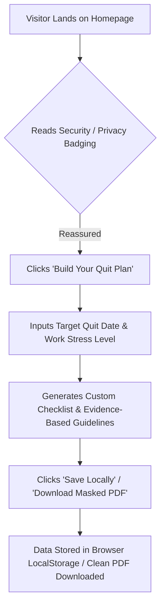
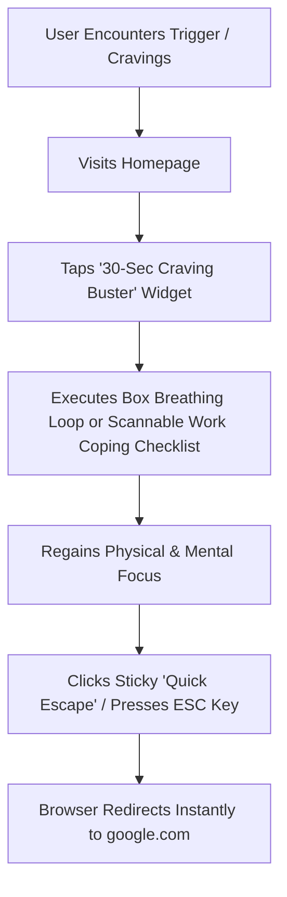
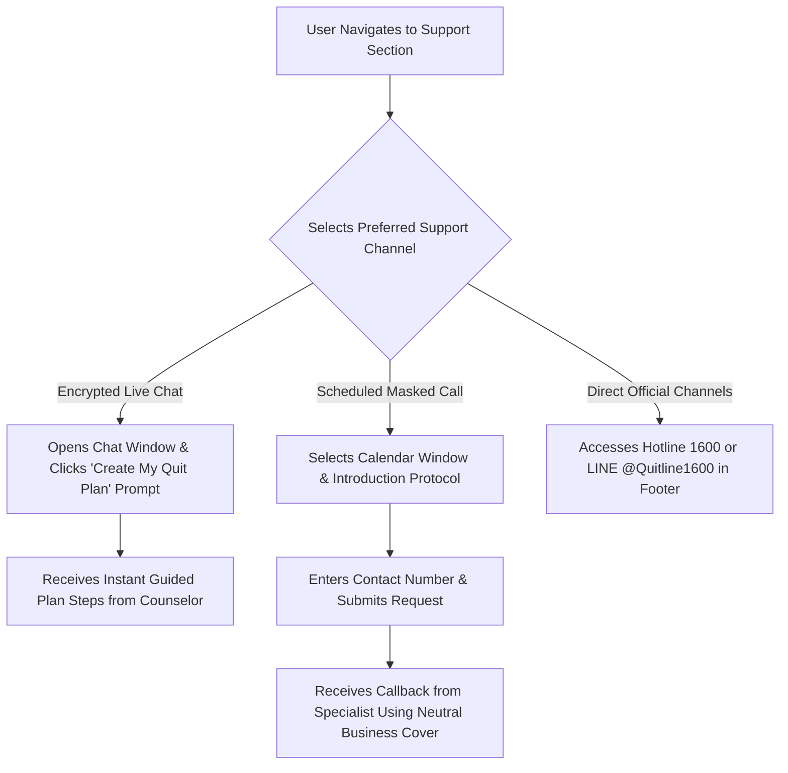

# User Flows & Journeys

This document defines the primary user journeys through the Quitline site, engineered specifically to support Ek's requirements for efficiency, privacy, and actionable guidance, fully aligned with `content-hierarchy.md` and `sitemap.md`.

---

## 🗺️ User Journey 1: Anonymous Plan Builder (Self-Directed)
*Objective: Build a custom quit smoking schedule, evidence-based guidelines, and coping strategy without sharing personal identity or logging data on a server.*

### Flow Highlights
*   **Zero-Gatekeeping:** No forms requesting email, phone, or name are required to generate or view the quit plan.
*   **No Cigs/Day Requirement:** Streamlined input focusing directly on Target Quit Date and Work Environment Stress Level.
*   **Clean Export:** The downloaded PDF is masked as a generic productivity planner (e.g., "Personal Performance Plan") rather than a conspicuous cessation document.

---

## ⚡ User Journey 2: Emergency Craving Support (Time-Critical)
*Objective: Quickly manage a severe smoking urge during high-stress business hours and immediately exit the screen if someone approaches.*

### Flow Highlights
*   **Instant Access:** The widget is single-tap and responsive, loading in under 1 second.
*   **Panic Exit:** The Escape key interceptor instantly closes/redirects the viewport to prevent over-the-shoulder detection.

---

## 📞 User Journey 3: Masked Contact & Direct Support Channels (Supported Cessation)
*Objective: Connect with cessation specialists via Encrypted Live Chat, Scheduled Masked Call, or direct official channels on the user's terms.*

### Flow Highlights
*   **Quick Chat Prompt:** The `"Create My Quit Plan"` CTA button inside Live Chat provides an immediate interactive prompt for guided plan creation.
*   **Masked Booking Protocols:** Users can select between two call introduction options:
    *   *Neutral Callback Inquiry*
    *   *Ask for me regarding...* (includes an optional text input box to specify custom cover topics e.g., "Corporate Consulting Follow-up").
*   **Official Credentials:** Verified Hotline (`1600`) and LINE ID (`@Quitline1600`) are prominently displayed in the footer for direct contact.